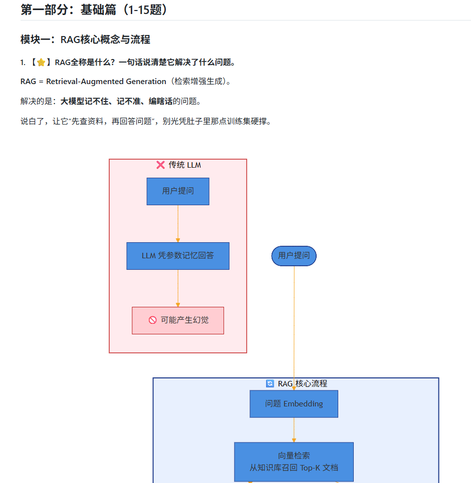
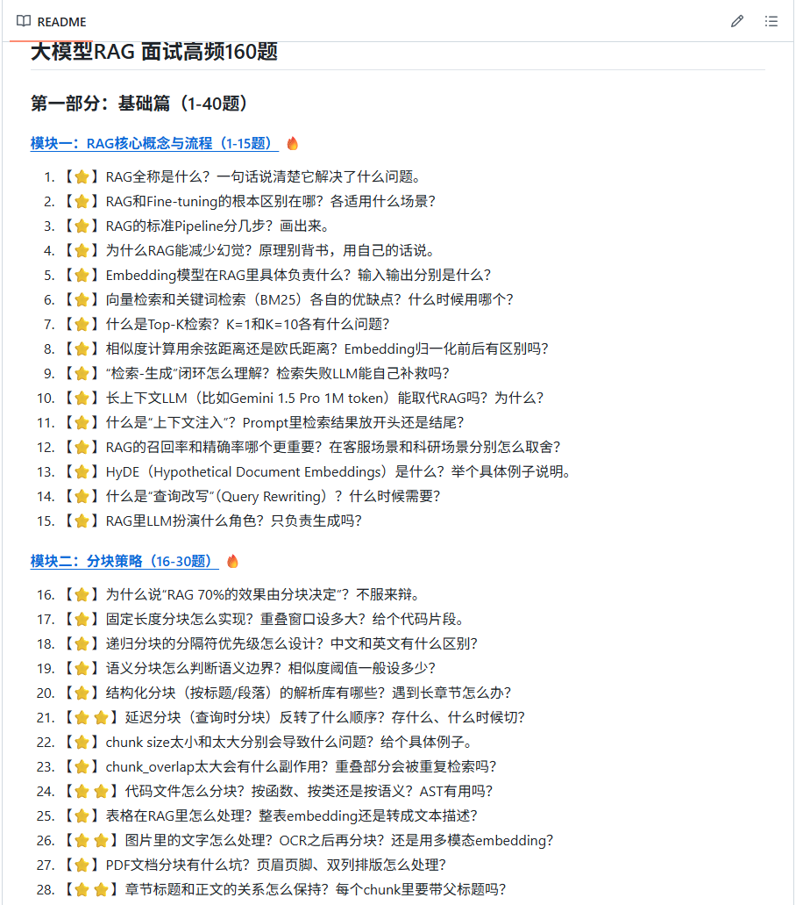

<div align="center">

# 大模型面试宝典

**AIGC / 大模型 / AI Agent 算法岗 · 800+ 高频面试考点**

> RAG 160 · Agent 100 · RL 后训练 120 · Hermes Agent 100 · GraphRAG 100 · Loop Engineering 100 · 目标检测 100 · 经典专题 30+

[](https://github.com/km1994/AIGC-Interview-Book/stargazers)
[](https://github.com/km1994/AIGC-Interview-Book/network/members)
[](https://github.com/km1994/AIGC-Interview-Book/commits/main)
[](docs/classic_question_bank.md)
[](CONTRIBUTING.md)

</div>

---

## 这是什么

一份**中文编写、按考点组织、持续更新**的大模型算法岗面试题库。

和"把别人的面经搬过来"不同，这里的每道题都按同一套结构写：**先给一句话答案，再拆为什么，最后给面试官会追问什么**。题目不考背诵，考的是你能不能把权衡讲清楚。

> 举个真题：**长上下文模型（Gemini 1.5 Pro 1M token）能取代 RAG 吗？**
> 面试官不想听"能"或"不能"。他想听你从 **成本、时效、可溯源** 三个维度拆开讲——拆得出维度，就是高分。

<div align="center">

</div>

## 这份题库的不同之处

| | 常见面经仓库 | 本仓库 |
|---|---|---|
| 组织方式 | 按文章 / 按公司 | **按考点**，每题带难度 ⭐ ⭐⭐ ⭐⭐⭐ |
| 答案形态 | 大段概念复述 | **一句话答案 + 深度拆解 + 避坑指南** |
| 题目取向 | 名词解释、背诵题 | **"为什么""怎么权衡""怎么落地"** |
| 技术时效 | 停更在某个时间点 | **跟到 2026 年的真高频**：Harness Engineering、Loop Engineering、GraphRAG、MCP |
| 参与方式 | 只能看 | **Issue 提新题 / PR 修答案，每条都看** |

## 适合谁

- 🎯 正在准备 **大模型算法岗、AI Agent 岗** 面试的同学（校招 / 社招 / 转岗都适用）
- 🔄 从 **CV、NLP、后端** 转 AIGC 的工程师——先补主干，再看方向
- 🧑‍💼 需要出题的 **面试官**——题目已按难度分层，可直接取用
- 📚 想系统梳理一遍大模型知识图谱的人

## 🗂️ 目录导航

| 模块 | 题量 | 已完成内容 | 直达 |
|---|---|---|---|
| 大模型 RAG | **160** | 40 题逐题详解 | [进入 →](docs/rag_160.md) |
| 大模型 Agent | **100** | 24 题逐题详解 | [进入 →](docs/agent_100.md) |
| 强化学习后训练（RLHF / PPO / DPO / GRPO） | **120** | 40 题逐题详解 + 作答要点 | [进入 →](docs/rl_post_training.md) |
| Hermes Agent 专题 | **100** | 22 题逐题详解 + 作答要点 | [进入 →](docs/hermes_agent.md) |
| Loop Engineering | **100** | 100 题作答要点 | [进入 →](docs/loop_engineering.md) |
| 知识图谱 GraphRAG | **100** | 100 题作答要点 | [进入 →](docs/graphrag.md) |
| 目标检测与机器视觉 | **100** | 100 题作答要点 | [进入 →](docs/cv_object_detection.md) |
| **经典专题（30+）** | 数百考点 | 专题题单 + 逐专题答案入口 | [进入 →](docs/classic_question_bank.md) |

<details>
<summary><b>经典专题包含哪些方向？（点击展开）</b></summary>

大模型基础面 · 进阶面 · 微调 · LangChain · RAG · PEFT · 推理 · 增量预训练 · 评测 · 强化学习 · 训练集 · 显存优化 · 分布式训练 · Agent · 位置编码 · Tokenizer · 推理加速 · 幻觉 · 模型对比 · CoT · 数据泄露 · MoE · 蒸馏 · 软硬件配置 · Token 与参数 · 多模态 · NLP · KV Cache · 角色扮演 · Chat o1 · DeepSeek-R1 · 推理大模型 · Kimi 1.5 · MCP · 上下文工程 · Qwen3

每个专题都配了对应的答案目录，点进专题里的"点击查看答案"即可。

</details>

<details>
<summary><b>已开源的逐题详解，直接看这里（126 题）</b></summary>

| 详解文件 | 覆盖 |
|---|---|
| [RAG 基础篇 15 题](rag/s1_foundation.md) | 概念、Pipeline、Embedding、检索、幻觉 |
| [RAG 分块策略 15 题](rag/s2_chunking.md) | 固定/递归/语义/延迟分块、代码与表格处理 |
| [RAG Embedding 10 题](rag/s3_embedding.md) | 模型选型、维度、微调、ColBERT、SPLADE |
| [Agent 基础篇 24 题](agent/s1.md) | Agent 概念、ReAct、工具调用、记忆系统 |
| [RL 后训练基础](ql/s1_base/s1_base.md) | RLHF 全流程、奖励模型、KL 约束 |
| [PPO 深度解析](ql/s2_PPO/s2.md) | 4 模型结构、优势函数、公式手推 |
| [DPO 深度解析](ql/s3_DPO/readme.md) | DPO 与 PPO 的取舍、损失函数推导 |
| [Harness Engineering 基础](Harness/s1_harness_base/readme.md) | Agent = Model + Harness、路由/记忆/权限 |
| [Harness 自进化核心](Harness/s2_harness_core/readme.md) | 技能自动生成、Nudge Engine、学习闭环 |

</details>

## 🚀 怎么刷效率最高

**第一步：先扫 ⭐ 题，建立主干。**
从 [RAG 核心概念](rag/s1_foundation.md) 和 [Agent 基础](agent/s1.md) 入手，每天 20 题，两周过一遍。这一步只求"见过"，不求背熟。

**第二步：练"讲"，别练"看"。**
对着 ⭐⭐ 高频题，合上屏幕自己讲一分钟，再对照答案查漏。面试考的是表达，不是记忆力。

**第三步：用 ⭐⭐⭐ 场景题做模拟面试。**
拿 [Loop Engineering](docs/loop_engineering.md)、[GraphRAG](docs/graphrag.md)、[目标检测](docs/cv_object_detection.md) 里的开放题自己出方案、讲权衡——这些题每题都写了「考察点 / 得分项」，正好用来给自己打分。

**按岗位选路线：**

- **算法岗**：经典专题的「基础面 → 微调 → 分布式训练 → 显存优化」，再切 [RL 后训练 120 题](docs/rl_post_training.md)
- **Agent / 应用岗**：[Agent 100 题](docs/agent_100.md) → [Hermes 专题](docs/hermes_agent.md) → [Loop Engineering](docs/loop_engineering.md) → 经典专题的 MCP / 上下文工程
- **从 CV/NLP 转 AIGC**：经典专题的「基础面 + 位置编码 + Tokenizer」打底，然后直奔 RAG 与 Agent
- **时间只剩一周**：只过 ⭐ 题 + [经典专题](docs/classic_question_bank.md) 里你目标岗位对应的那一栏

## 🧭 题目长什么样

每道题都是同一套三段结构，方便你直接搬进自己的答题模板：

```
【⭐⭐】为什么说"RAG 70% 的效果由分块决定"？

💡 考察点：是否理解分块对召回质量的决定性影响，而不是只会调 chunk_size
🎯 得分项：能说清 分块 → 召回 → 生成 的传导链路；能给出具体 chunk 大小区间
✅ 作答要点：分块决定了检索单元的信息完整度。切碎了语义断裂，切大了噪声淹没……
```

<div align="center">

</div>

## 🗓️ 更新计划

| 状态 | 内容 |
|---|---|
| ✅ 已完成 | RAG 40 题、Agent 24 题、RL 后训练 40 题、Hermes 22 题 逐题详解 |
| ✅ 已完成 | Loop Engineering / GraphRAG / 目标检测 各 100 题「考察点 + 得分项 + 作答要点」 |
| ✅ 已完成 | RAG 进阶篇与实战篇（41-160 题）逐题详解补齐 |
| ✅ 已完成 | Agent 工具系统、多 Agent 协作章节详解 |
| 📌 计划中 | 面经投稿真实面试复盘、大厂题库整理、季度高频考点变化 |

> 大模型这行变化快，本仓库会持续跟。想第一时间拿到更新，可以关注公众号（见文末）。

## 🤝 参与共建

内容靠大家，欢迎以任何方式参与：

- **提出问题 / 补充新题** → 提 [Issue](https://github.com/km1994/AIGC-Interview-Book/issues/new)
- **修正答案、改错别字、补链接** → 提 [Pull Request](https://github.com/km1994/AIGC-Interview-Book/pulls)，哪怕只改一个字
- **分享真实面经** → 在 Issue 里按「公司 / 岗位 / 轮次 / 题目 / 复盘」写下来，我会整理进仓库
- **发现题目过时或有争议** → 直接说出来，标注依据即可

具体的提交规范见 [CONTRIBUTING.md](CONTRIBUTING.md)。每一条 Issue 和 PR 我都会看，有贡献的伙伴会出现在更新说明里。

## ⭐ 觉得有用？

如果这份题库帮到了你的面试准备，**点一个 Star** 就是最大的支持——它能让更多正在准备面试的人搜到这份内容，也能让我知道该继续投入。

> 也欢迎把它转给身边正在准备大模型面试的朋友。

## 📮 持续更新的地方

题库的完整答案、更新最快的部分，放在公众号和知识星球的《大模型面试宝典》专栏：

- **公众号：关于NLP那些你不知道的事** —— 回复「**大模型**」领取高频考点 PDF
- **知识星球「大模型面试宝典」** —— 实战篇 / 场景题的完整解析与更新

<div align="center">

</div>

## ⚠️ 声明

- 本仓库内容由作者根据一线面试与工程实践整理，**免费开源**，欢迎转载分享（请附仓库链接）。
- 部分进阶题标注「可参考最新论文」，个别说法（如"RAG 70% 效果由分块决定"）属业内流传经验，暂无严格论文出处，请以批判视角看待。
- 若发现错误，欢迎提 Issue 纠错——**被指出错误并修正，比不出错更重要**。

<div align="center">
<br/>
<b>如果这些题目让你在面试里多讲对了一句话，那这个仓库就值了。</b>
<br/><br/>
<a href="https://github.com/km1994/AIGC-Interview-Book/stargazers">⭐ Star 本项目</a>
</div>
